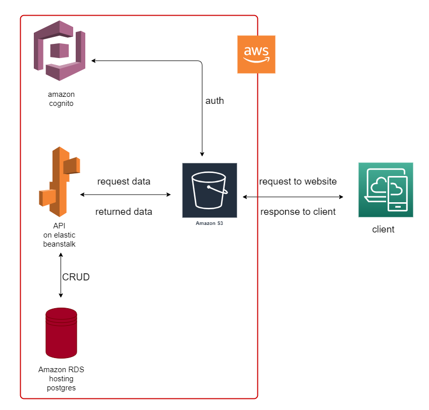

## Udagram Infrastructure

### AWS
#### RDS Postgres
The application server uses AWS RDS Postgres as database for storing and retrieving information.

#### Elastic Beanstalk
The application server is deployed on AWS Elastic Beanstalk service. The application is build, archived and uploaded
to and S3 bucket from where Elastic Beanstalk extracts and runs the application on an endpoint.

#### S3 Bucket
The frontend application is deployed using AWS S3 Bucket. 

Bucket URL: `http://mybucket0566704796.s3-website-us-east-1.amazonaws.com`

End users can access the application from the Bucket URL.