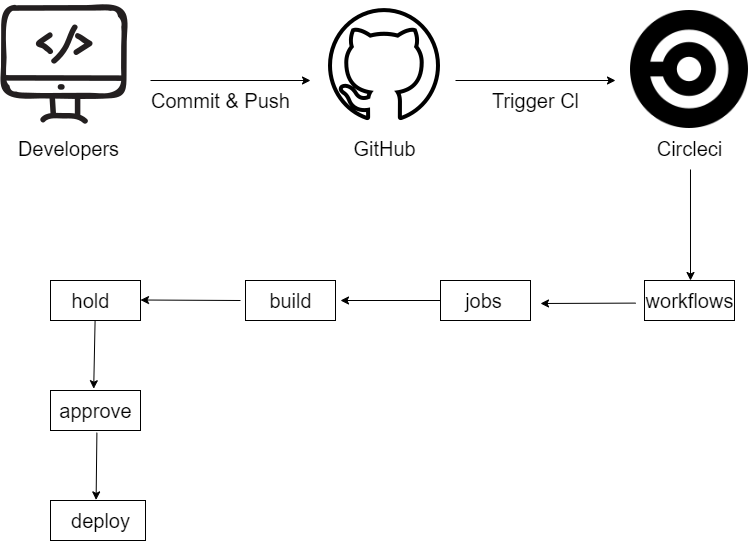

## Udagram Pipeline

#### GitHub
The developers commit and push their code to the GitHub repository which is linked to the CircleCI platform.

#### CircleCI
CircleCI reads the `.circleci/config.yml` file which tells the service what has to be done.
